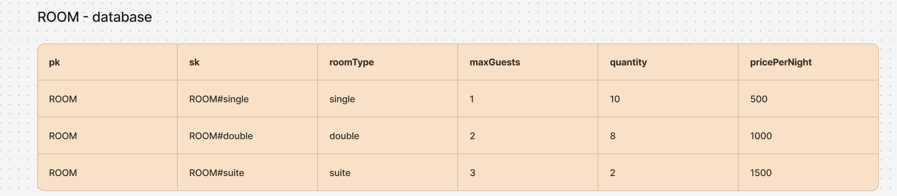
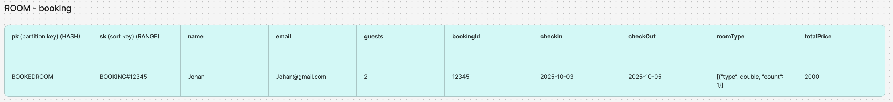
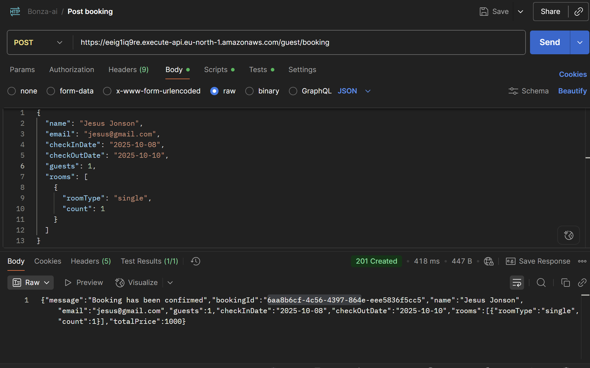
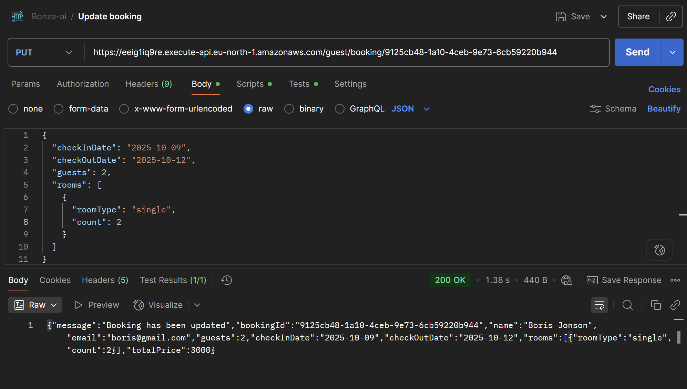
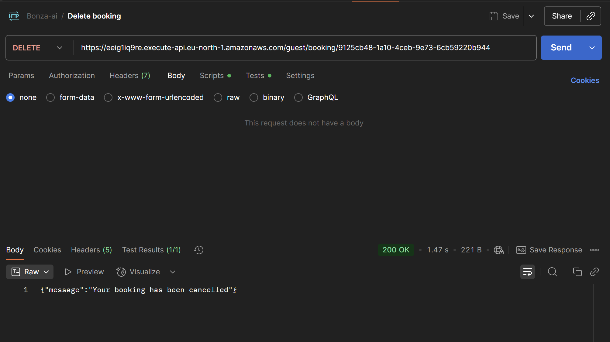
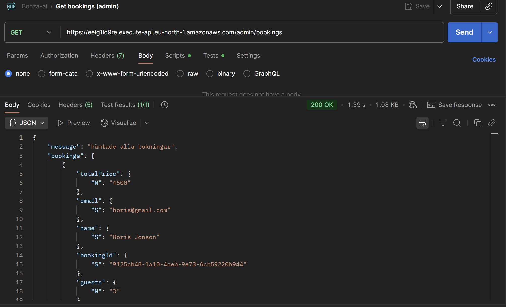

# Bonza.ai – Serverless Hotel Booking API

Det här projektet är en del av Bonza-examen och bygger ett serverless bokningssystem i AWS.
Systemet hanterar rumstyper, bokningar och administration via ett API.

## Databasöversikt
Se bifogade diagram i `assets/images`:

- **ROOM-database** 
- **ROOM-booking** 

## Testa API:et
Du kan testa API:et och databasen med Postman/Insomnia via den bifogade collection-filen:

[Öppna Collection](./assets/Bonza-ai.postman_collection.json)

Exempelanrop:
- POST      
https://eeig1iq9re.execute-api.eu-north-1.amazonaws.com/guest/booking

- PUT    
https://eeig1iq9re.execute-api.eu-north-1.amazonaws.com/guest/booking/{bookingId}

- DELETE 
https://eeig1iq9re.execute-api.eu-north-1.amazonaws.com/guest/booking/{bookingId}

- GET                
https://eeig1iq9re.execute-api.eu-north-1.amazonaws.com/admin/bookings

## Installation
För att sätta upp projektet lokalt behöver du ett eget AWS-konto.
Uppdatera **org** och **role** i `serverless.yml` innan deploy.

Kör följande i terminalen:

```bash
git clone https://github.com/jakobmalmgren/Bonza-ai.git
cd Bonza-ai
npm install -g serverless
node scripts/seedRooms.mjs # lägger till rum i databasen som vi utgår ifrån
sls deploy   # eller serverless deploy


<!--------------------------------------------------------------------------------------------------------------------------------------------------------------!>

title: 'AWS Simple HTTP Endpoint example in NodeJS'
description: 'This template demonstrates how to make a simple HTTP API with Node.js running on AWS Lambda and API Gateway using the Serverless Framework.'
layout: Doc
framework: v4
platform: AWS
language: nodeJS
authorLink: 'https://github.com/serverless'
authorName: 'Serverless, Inc.'
authorAvatar: 'https://avatars1.githubusercontent.com/u/13742415?s=200&v=4'
-->

# Serverless Framework Node HTTP API on AWS

This template demonstrates how to make a simple HTTP API with Node.js running on AWS Lambda and API Gateway using the Serverless Framework.

This template does not include any kind of persistence (database). For more advanced examples, check out the [serverless/examples repository](https://github.com/serverless/examples/) which includes Typescript, Mongo, DynamoDB and other examples.

## Usage

### Deployment

In order to deploy the example, you need to run the following command:

```
serverless deploy
```

After running deploy, you should see output similar to:

```
Deploying "serverless-http-api" to stage "dev" (us-east-1)

✔ Service deployed to stack serverless-http-api-dev (91s)

endpoint: GET - https://xxxxxxxxxx.execute-api.us-east-1.amazonaws.com/
functions:
  hello: serverless-http-api-dev-hello (1.6 kB)
```

_Note_: In current form, after deployment, your API is public and can be invoked by anyone. For production deployments, you might want to configure an authorizer. For details on how to do that, refer to [HTTP API (API Gateway V2) event docs](https://www.serverless.com/framework/docs/providers/aws/events/http-api).

### Invocation

After successful deployment, you can call the created application via HTTP:

```
curl https://xxxxxxx.execute-api.us-east-1.amazonaws.com/
```

Which should result in response similar to:

```json
{ "message": "Go Serverless v4! Your function executed successfully!" }
```

### Local development

The easiest way to develop and test your function is to use the `dev` command:

```
serverless dev
```

This will start a local emulator of AWS Lambda and tunnel your requests to and from AWS Lambda, allowing you to interact with your function as if it were running in the cloud.

Now you can invoke the function as before, but this time the function will be executed locally. Now you can develop your function locally, invoke it, and see the results immediately without having to re-deploy.

When you are done developing, don't forget to run `serverless deploy` to deploy the function to the cloud.
